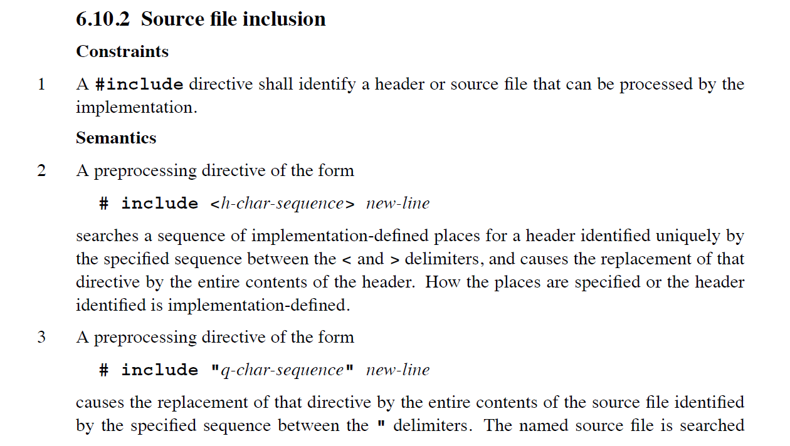
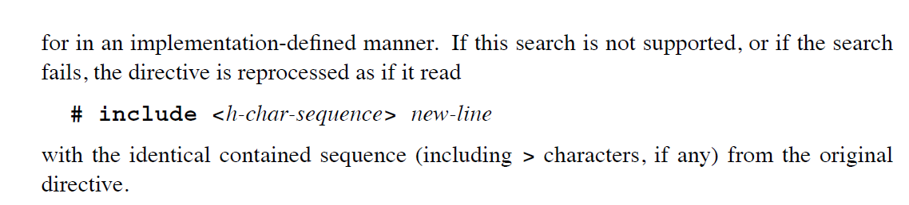

# c-lang-header-inclusion-in-detail
详细漫谈C语言头文件包含 **`#include <header.h>`** 与 **`#include "header.h"`** 的区别

<br />

学习过C语言的朋友想必对C语言中 **`#include <header.h>`** 以及 **`#include "header.h"`** 这种头文件包含语法已经轻车熟路了。本文的目的不是想手把手再教各位一遍关于头文件包含这种预处理器的用法，而是想通过一个实际项目例子来更清晰地描述一下使用 **`<header.h>`** 与 **`"header.h"`** 这两种头文件包含在实际系统环境和项目工程中使用上的差异。

为了避免后续理解上的误区或是对本文某些描述上的误解，这里先放上C语言标准中关于头文件包含的官方描述，请见以下两图。





从上面两图中的描述我们可以看出，C语言标准官方无论是对于 **`#include <header.h>`** 这种形式，还是对于 **`#include "header.h"`** 均用了 **implementation-defined** 术语，因而也明确地表示了这两种头文件包含的行为都是由编译器实现自己定义的。不过官方标准也明确阐述了，对于 **`#include "header.h"`** 这种形式如果指定的头文件搜索不到，则会再尝试使用 **`#include <header.h>`** 这种形式进行搜索。因此使用双引号形式的头文件包含采用的是优先级更高的搜索。

而对于现代主流桌面C语言编译器（MSVC、GCC、Clang，以及用它们魔改的编译器实现，比如Intel C++编译器、ARM Studio等），对于这两种头文件包含均已有了比较明确的描述——

- **`#include "header.h"`** 形式：优先搜索当前包含此 **header.h** 头文件的C源文件所在的路径，如果在当前此C源文件所在的路径无法搜索到，则再次尝试使用 **`#include <header.h>`** 这种形式进行搜索。
- **`#include <header.h>`** 形式：优先搜索通过编译器选项（比如MSVC是`/I`，GCC/Clang编译器是`-I`）所指定的include路径列表，如果搜索不到则再搜索当前系统环境变量（比如Windows系统下的PATH环境变量以及MSVC所指定的编译环境路径；Linux系统下则是`/etc/profile`文件中列出的路径以及GCC等编译器指定的编译环境路径）中所列出的路径。

有了上述这些系统平台以及编译器约定成俗的实现，我们对这两种头文件包含形式就会有更清晰的认识了。

<br />

为了给大家有一个更直观、更感性地认识，这里放了一个Visual Studio 2022的一个C语言项目itest，大家可以在自己的PC上试验一把，只需下载免费的Visual Studio 2022 Community Edition即可。为了对头文件包含有更清晰的认识，本项目的目录设置也会相对而言比较复杂，因此下面列出了本项目的一个目录包含概要图：


为了要区分对 `<header.h>` 和 `"header.h"` 的包含区别，这里引入了两个额外的目录：**mymodule**目录作为当前项目的内部模块而被使用，这就意味着我们能很自然地利用当前项目的相对路径去访问mymodule下的头文件。同时，mymodule下的头文件或源文件也可以i包含该目录外部的本项目目录下的其他头文件，比如`mymodule/stdio.h`的这种包含：
```c
#include "../common.h"
#include "func/func.h"
```

还有`mymodule/func/func.h`头文件中的包含：
```c
#include "../../common.h"
#include "../stdio.h"
```
这种基于当前项目相对路径的包含就充分利用了之前所描述的 `#include "header.h"` 这种头文件包含形式的特性——即，优先搜索当前包含此头文件的C源文件下的路径。比如对于`mymodule/stdio.h`这个头文件而言，`../`路径就是它上一层的目录itest，而`func/`则是它所处的 **mymodule** 目录中的一个子目录。

此外，本项目设置了 `/I"extmodule"` 这一编译选项，因此是将extmodule这一目录作为一个首要的编译搜索路径。因此我们在main.c源文件中所看到的第8行：
```c
#include <func/stdio.h>
```
所表示的是包含`extmodule/func/stdio.h`。当然，如果这里使用 `#include "func/stdio.h"` 也完全没有问题，毕竟双引号的形式其实是尖括号形式的超集。

说到这里，***大家可以动手试一试：***

大家可以把`extmodule/stdio_err.h`这一文件名修改为`stdio.h`，看看会发生啥？

大家试过之后就会看到，编译会报错。为啥会报错呢？因为我们在main.c的第一行所写的`#include <stdio.h>`将会包含`extmodule/stdio.h`而不是MSVC所指定的CRT库中的`<stdio.h>`。因此这也进一步证实了，给当前编译选项指定的搜索路径的优先级高于编译器默认指定的搜索路径。

<br />

#### 写在最后（One More Thing）

上面提到过，在某些情况下，使用 **`#include <header.h>`** 与 **`#include "header.h"`** 是等价的，比如上述提到的 `#include <func/stdio.h>` 可以替换为 `#include "func/stdio.h"`，那么我们该如何选择呢？本人的用法准则如下：

- 如果当前源文件所要包含的头文件是与该源文件作为同一模块的，则使用 **`#include "header.h"`** 这种形式；
- 如果当前源文件所要包含的头文件属于一个外部功能模块，则一般使用 **`#include <header.h>`** 这种形式。
- 对于 **`#include "header.h"`** 这种形式，一般优先使用相对于当前源文件的相对路径的表达形式，比如像demo工程中列出的 `#include "../common.h"`。这种形式会使得双引号这种搜索行为立即生效。

